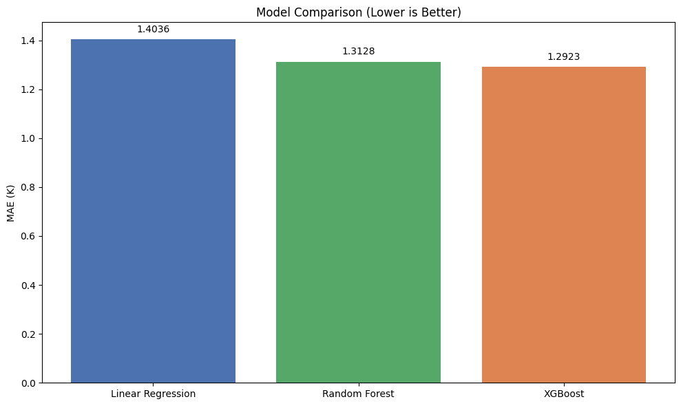
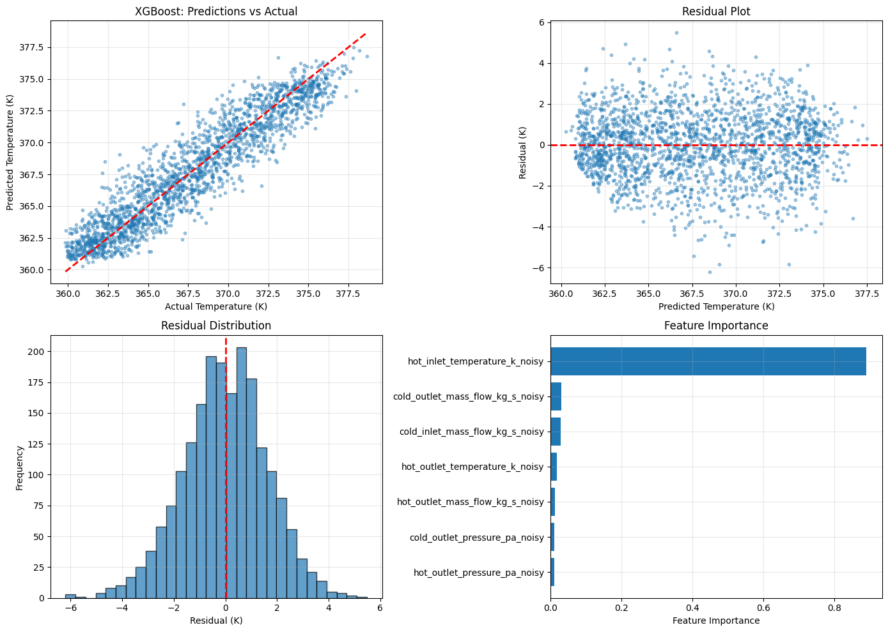
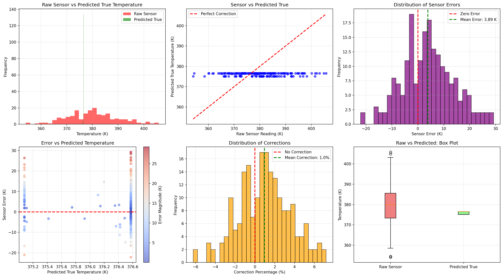

# 🌡️ Heat Exchanger Temperature Prediction using Machine Learning


---

## 📖 Overview

In industrial systems, **heat exchangers** play a critical role in transferring heat between fluids. Their performance is monitored using multiple temperature, pressure, and flow sensors.

However, real-world sensor readings are often affected by

- Sensor noise
- Calibration drift
- Environmental disturbances
- Measurement uncertainty

These inaccuracies make it difficult to estimate the **true operating temperature**, reducing reliability and potentially affecting process efficiency.

Instead of relying solely on noisy measurements, this project explores whether **machine learning can learn the relationship between sensor readings and the underlying true temperature.**

---

## 🎯 Objective

Build a machine learning pipeline capable of predicting the **true heat exchanger temperature** from noisy industrial sensor measurements.

The pipeline includes

- Data preprocessing
- Exploratory Data Analysis
- Feature Engineering
- Model Training
- Model Comparison
- Model Persistence
- Batch Prediction
- Visualization

---

## 🧠 Machine Learning Models

Three regression models were trained and evaluated.

| Model | Purpose |
|-------|----------|
| Linear Regression | Baseline model |
| Random Forest | Non-linear ensemble learning |
| XGBoost | Gradient boosting regression |

Performance was evaluated using

- Mean Absolute Error (MAE)
- Mean Squared Error (MSE)
- Root Mean Squared Error (RMSE)
- R² Score

---

# 📊 Model Comparison



XGBoost achieved the best overall performance among the evaluated models.

---

# 🔬 Model Diagnostics



These visualizations include

- Predictions vs Actual
- Residual Plot
- Residual Distribution
- Feature Importance

These plots help evaluate

- prediction accuracy
- residual behavior
- feature contribution
- model robustness

---

# 📈 Batch Prediction Analysis



The trained model can perform batch predictions on new industrial sensor readings.

The analysis includes

- Sensor error distribution
- Correction percentage
- Predicted temperature distribution
- Box plots
- Error visualization

---

## 📂 Repository Structure

```
heat-exchanger-temperature-prediction
│
├── data/
├── models/
├── notebooks/
├── results/
├── src/
├── README.md
├── requirements.txt
└── LICENSE
```

---

## ⚙️ Installation

```bash
git clone https://github.com/Priyanshu-Technologies/heat-exchanger-temperature-prediction.git

cd heat-exchanger-temperature-prediction

pip install -r requirements.txt
```

---

## 📁 Dataset

The original dataset was obtained from **Kaggle**.

To respect the dataset's licensing, it is **not redistributed** in this repository.

Download the dataset from its original source and place it inside the `data/` directory before training.

---

## 🚀 Future Work

- Hyperparameter Optimization
- Neural Network Regression
- Real-time Temperature Prediction
- Model Deployment using FastAPI
- Explainable AI (SHAP)
- Physics-informed Machine Learning

---

## 👨‍💻 Author

**Priyanshu Sharma**

GitHub:
https://github.com/Priyanshu-Technologies

LinkedIn:
https://www.linkedin.com/in/priyanshu-sharma-646233394/

---

*"Building to understand. Learning to build."*
